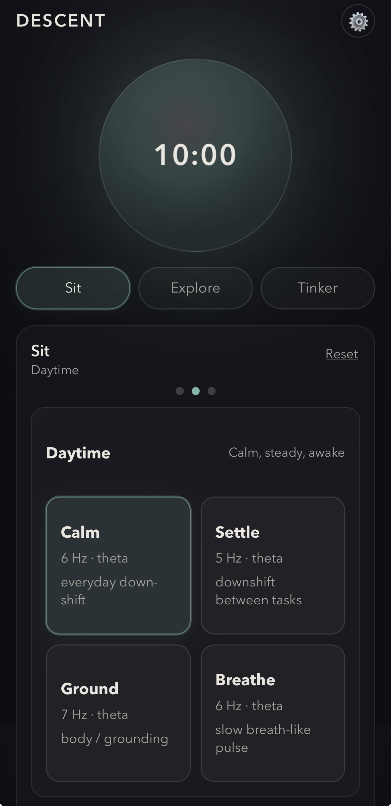
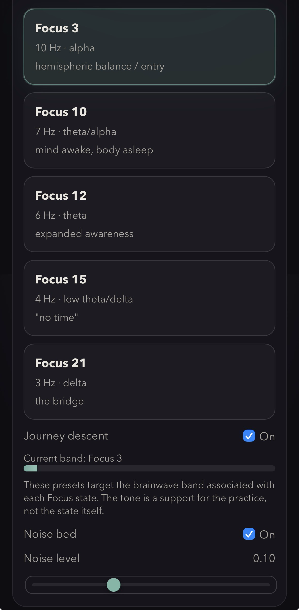
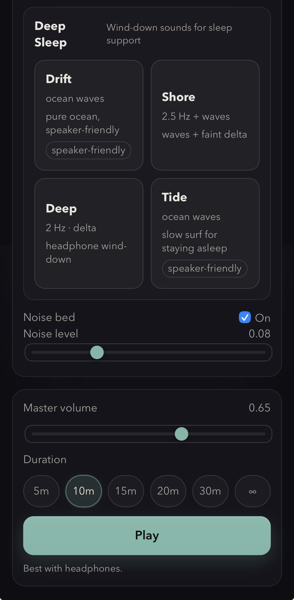

# Descent

**A binaural-beat meditation tool that runs entirely in your browser. No app, no account, no tracking.**

🎧 **[Try it live →](https://hoatscs-droid.github.io/descent)** *(best with headphones)*

Descent generates layered audio environments — binaural beats, a warm noise bed, and slow amplitude modulation — designed as a space for relaxation and focus. It runs on any phone or computer, installs to your home screen like an app, and works fully offline. Everything happens on your device; nothing is ever sent anywhere.

---

## What it does

Descent has three modes:

- **Sit** — one-tap presets for everyday use, organized into three swipeable panes: **Focus**, **Daytime**, and **Deep Sleep**. The library includes alpha-focused work states, theta downshift presets, delta wind-down tones, and speaker-friendly ocean soundscapes.
- **Explore** — a descent through the brainwave bands, inspired by the Monroe Institute's Gateway "Focus" states (Focus 3 → 10 → 12 → 15 → 21). Hold a single band, or turn on **Journey** and let it glide downward through the ladder over your session, the texture deepening as you go.
- **Tinker** — a two-oscillator playground. Independent pitch, waveform, lowpass, pan, and volume for each oscillator; a customizable noise bed; and independent pulse depth and rate for both the tone and the noise. Fine-adjust − / + steppers with hold-to-repeat and tap-to-type readouts make precise tuning practical on a phone. Build your own sound and save it as a preset.

A slow breathing circle gives you something to pace your breath to while a session is playing. Sessions can be timed, adjusted live, or open-ended (∞). Non-sleep sessions fade out gently and end with a soft chime; Deep Sleep sessions use a long ~30s fade with no chime. A **Keep screen awake** toggle is on by default for focused sessions and can be turned off for all-night sleep sessions. On supported browsers, lock-screen and AirPods media controls can truly pause and resume, preserving elapsed time and audio position instead of restarting the session.

---

## Install on iPhone (or any device)

It's a Progressive Web App, so "installing" just adds it to your home screen:

1. Open **[the live link](https://hoatscs-droid.github.io/descent)** in Safari.
2. Tap the **Share** button, then **Add to Home Screen**.
3. Launch it from the icon — it opens full-screen like a native app and works offline.

On Android, use Chrome's "Add to Home screen" / "Install app" option. On desktop, it runs in any modern browser.

**Use headphones.** Binaural beats depend on each ear hearing a slightly different frequency, so they only work with stereo separation — headphones or earbuds, not a speaker.

---

## About the science (read this)

Descent uses **binaural beats** (a perceived pulse created when each ear hears a slightly different tone) and **amplitude modulation** (a slow swell) to create an audio environment for relaxation and focus.

Honest framing:

- Research on binaural beats is **mixed**, and where effects exist they tend to be **subtle and individual**. This is not a guaranteed or clinically validated effect.
- The **Focus levels** in Explore are inspired by the Monroe Institute's Gateway states and target the brainwave bands associated with each. They are an **aesthetic and experiential framework, not a clinical protocol** — the tone supports the practice; it isn't the state itself.
- Descent does **not** use solfeggio frequencies or make any "healing frequency" claims, because those aren't supported by evidence.
- **Descent is not a medical device, makes no health claims, and is not a substitute for medical or mental-health care.**

If it helps you relax or focus, wonderful. That's the whole goal. Approach it as a calm, well-made tool — not medicine.

---

## Privacy

Descent runs **entirely on your device.** No accounts, no analytics, no servers, no network requests of any kind. Your saved presets live in your browser's local storage and never leave your phone. There is nothing to collect, so nothing is collected.

---

## Tech

A single `index.html` — pure HTML, CSS, and JavaScript using the Web Audio API. No frameworks, no build step, no dependencies, no external requests. The whole app is one file you can read top to bottom.

Built with special care for iPhone Safari / installed PWA behavior:

- Audio starts only from a user gesture and resumes the `AudioContext` inside that gesture.
- The app requests a playback audio session where supported, which helps Web Audio continue when the hardware silent switch is on.
- A screen Wake Lock keeps sessions from being interrupted while the app is visible, controlled by the in-app **Keep screen awake** toggle.
- Timers use elapsed-time accounting rather than trusting `setInterval`, so pause/resume, lock-screen media controls, and duration changes stay accurate.
- Reduced-motion support respects `prefers-reduced-motion`.

---

## License

[MIT](LICENSE) — free to use, modify, and build on. No warranty.

---

*Made as a personal project, shared in case others find it useful. Feedback welcome via Issues.*
